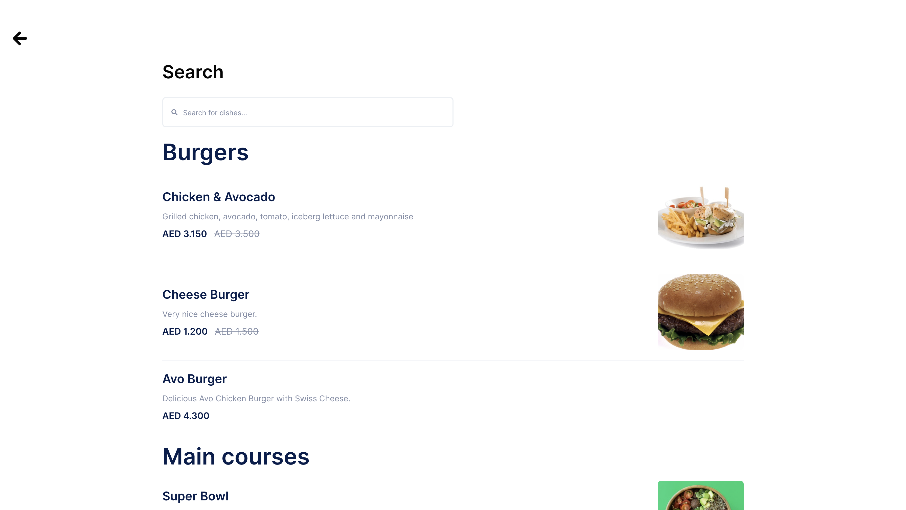
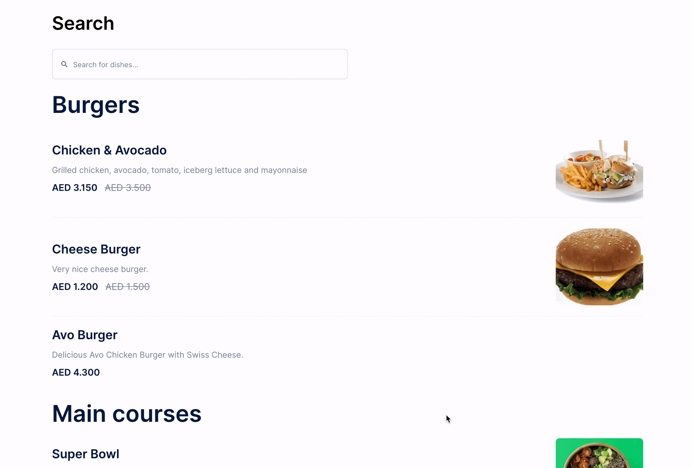
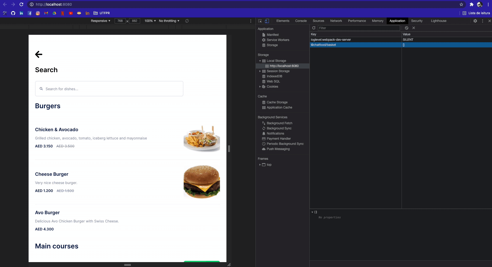

<h1 align="center">
  
</h1>

<h3 align="center">
  Teste para a Chatfood utilizando VueJS
</h3>

Repostório dedicado para realizar o teste proposto pela Chatfood, utilizando VueJS.

<blockquote align="center">“Programs must be written for people to read, and only incidentally for machines to execute.” ― Harold Abelson</blockquote>

  <a href="#sobre-o-teste">Sobre o teste</a>&nbsp;&nbsp;&nbsp;|&nbsp;&nbsp;&nbsp;
  <a href="#funcionamento">Funcionamento</a>&nbsp;&nbsp;&nbsp;|&nbsp;&nbsp;&nbsp;
  <a href="#ver-funcionando">Ver funcionando</a>

## Sobre o teste

Esse é o teste proposto pela [Chatfood](https://www.chatfood.io/), com o intuito de analisar
e contratar um desenvolvedor front-end.

O teste consistia no desenvolvimento de uma aplicação, onde fosse possível mostrar um menu de items, separados por categorias, e filtrá-los por nome.

<h1 align="center">
  
</h1>

### **Tecnologias utilizadas para o teste**

- :green_heart: &nbsp;**[VueJS](https://vuejs.org/)** — Biblioteca JavaScript para desenvolvimento de interfaces de páginas web;
- :purple_heart: &nbsp;**[Jest & Vue-test-utils](https://next.vue-test-utils.vuejs.org/guide/)** — Bibliotecas para realizar testes unitários;
- :yellow_heart: &nbsp; Prettier, ESlint e EditorConfig - Tecnologias para padronização de código;
- :blue_heart: &nbsp; [TypeScript](https://www.typescriptlang.org/) - Tecnologia para tipagem e melhoria de arquitetura JavaScript.

## Funcionamento

<h1 align="center">
  
</h1>

Como se pode perceber no gif acima, a aplicação consiste em um cardápio com items, espalhados por diversas categorias. Esses items
vem de uma [API](https://chatfood-cdn.s3.eu-central-1.amazonaws.com/fe-code-challenge-1/menu.json), disponibilizada pela própria Chatfood.

Os pontos interessantes dessa aplicação se resumem muito mais em código do que em layout. O teste foi desenvolvido utilizando a Composition API,
nova feature trazida pela terceira versão do Vue. Visto isso, é interessante analisar o código, pois existem diversas funcionalidades que mudaram
do Vue 2 para o Vue 3, e todas estão baseadas na [documentação oficial](https://v3.vuejs.org/guide/introduction.html).

Outro destaque do código são os testes funcionais. Eles foram feitos utilizando padrões de código do [JEST](https://jestjs.io/) e as ferramentas
disponibilizadas pelo [Vue Test Utils](https://next.vue-test-utils.vuejs.org/guide/). Os testes foram definidos seguindo a metodologia de cobertura
de código, provida pelo próprio JEST, utilizando a tag --coverage. É interessante citar que os códigos providos nesse projeto cobrem 100% do código.

Por fim, o ponto de mais destaque nesse projeto: O tão amado [TypeScript](https://www.typescriptlang.org/). Tanto nos testes quanto na construção do
app, ele está 100% presente, seguindo todas as recomendações da documentação do Vue, do Vuex e do Vue Test Utils, facilitando a leitura e o 
entendimento do código.

<h1 align="center">
  
</h1>

No gif acima, pode-se perceber também que, ao clicar em um item, ele é persistido no [Local Storage](https://developer.mozilla.org/pt-BR/docs/Web/API/Window/localStorage)
do navegador. Ao clicar em um item que há estoque disponível, ele é adicionado, aumentando a quantidade se já tiver sido adicionado alguma vez.
Caso o usuário tente adicionar uma quantidade indisponível, um alerta é mostrado em tela. Caso não haja estoque algum, outro alerta também 
é exibido.

A seta que se encontra acima do aplicativo em questão serve para realizar o reset completo do aplicativo. A API será novamente carregada,
o Local Storage será zerado, tão quanto a store.

## Ver funcionando

Para análise de código, este repositório foi criado utilizando a arquitetura de componentização. Sobre a arquitetura de pastas:

* *components* - Componentes reutilizáveis da aplicação
* *helpers* - Funções puras que recebem argumentos e retornam esses argumentos formatados de alguma maneira
* *mocks* - Arquivos .json utilizados para testes
* *router* - Definições das rotas da aplicação
* *services* - Pasta com serviços externos, como o axios para a utilização da API
* *store* - Definições de Vuex e seus módulos
* *styles* - Definição de estilos globais e breakpoints
* *types* - Definições de interfaces para a aplicação
* *views* - Definição das páginas da aplicação

Para análise e ver funcionando diretamente na máquina local:

1. Clone este repositório utilizando o comando <code> git clone https://github.com/LuccasPiola/teste-chatfood.git </code>
2. Entre na pasta clonada utilizando <code>cd teste-chatfood</code>
3. Rode o comando <code>yarn</code> no terminal, para a instalação das dependências  
   &nbsp; &nbsp; 3.1 Caso você não tenha o yarn como gerenciador de dependências, rode  comando <code>npm install --global yarn</code>  
   &nbsp; &nbsp; &nbsp; &nbsp; 3.1.1 Caso você também não tenha o npm como gerenciador de dependências, consulte a [documentação oficial](https://docs.npmjs.com/downloading-and-installing-node-js-and-npm)
4. Rode o comando <code>yarn serve</code> no terminal
5. Abra uma aba no seu navegador e digite <code>http://localhost:8080 </code>
6. Para rodar os testes, digite <code>yarn test:unit </code> e digite o caractere <code>a</code> para rodar todos os testes
7. Para análise de coverage, digite <code>yarn test:coverage</code>. Uma pasta /coverage irá surgir no diretório do projeto. Abra-a, entre na pasta
   <code>Icov-report</code> e abra o arquivo <code>index.html</code>. Lá, uma análise completa do coverage estará disponível.

---

This test was made by Chatfood. Repository by Luccas Piola. ♥ &nbsp; for JavaScript.
